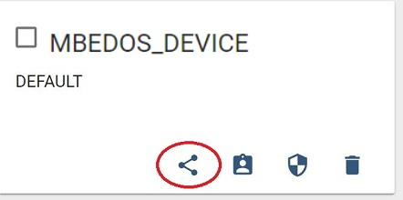

# Air Quality Demo - MBED edition

## Summary

This is a demo project showing the integration of Sensirion's environmental sensors with Cypress devices supporting MBED OS, using http://thingsboard.io as an online dashboard. Sensors used are the SHTC1 temperature humidity sensor and SGP30 air quality sensor as well as the SPS30 particulate matter sensor.

This demo was prepared using the [PSoC® 6 WiFi-BT Pioneer Kit (CY8CKIT-062-WiFi-BT)](https://www.cypress.com/documentation/development-kitsboards/psoc-6-wifi-bt-pioneer-kit-cy8ckit-062-wifi-bt), but should work on any MBED OS device, requiring only adjustments if a board has a non-standard setup.

This tutorial assumes that the user is familiar with MBED OS, MBED Studio, and Thingsboard. For questions on how to use these tools, please check their respective documentation.


The drivers for this demo are implemented using Sensirion's standard embedded drivers:
- SPS30: https://github.com/Sensirion/embedded-sps
- SHTC1: https://github.com/Sensirion/embedded-sht
- SGP30: https://github.com/Sensirion/embedded-sgp

## Table of contents

This documentation is separate into the following chapters:
1. [Hardware setup](#hardware-setup)
1. [Software downloads](#software-downloads)
1. [Dashboard setup](#dashboard-setup)
1. [Device setup](#device-setup)

## Hardware setup

### Components

The hardware setup consists of the following components:

-  [PSoC® 6 WiFi-BT Pioneer Kit (CY8CKIT-062-WiFi-BT)](https://www.cypress.com/documentation/development-kitsboards/psoc-6-wifi-bt-pioneer-kit-cy8ckit-062-wifi-bt) or other compatible MBED OS reference design
- Sensirion Environmental Sensor Shield (ESS) featuring the SHTC1 and SGP30 sensors
- Sensirion SPS30 particulate matter sensor

The ESS requires a hardware platform which has Arduino-compatible expansion headers. Subsequenty, we will assume that the platform chosen has such expansion headers.

**Note:** Of course, the software will also work for other sensor boards featuring the SHTC1 and SGP30 sensor components, as long as they are correctly wired.

### Interface cable for the SPS30

The interface of the SPS30 is described in its datasheet (chapter "Hardware Interface Specifications"). The connector is a ZHR-5 from JST Sales America Inc. The pin out is defined as follows when using the sensor in I2C mode:

| Pin  | Function          |
| ---- | ----------------- |
| 1    | VDD               |
| 2    | SDA               |
| 3    | SCL               |
| 4    | SEL (GND for I2C) |
| 5    | GND               |

To make the cable, it's easier to buy pre-crimped cables.
- 1x [ZHR-5 connector](https://www.digikey.com/product-detail/en/jst-sales-america-inc/ZHR-5/455-1201-ND/608642)
- 5x [Pre-crimped 6" wires](https://www.digikey.com/product-detail/en/jst-sales-america-inc/ASZHSZH28K152/455-3079-ND/6009455)

In addition, to connect to the reference design, you can use any jumper cables you have available. Choose either a male of female connector based on your reference design. To connect to the ESS, female connectors are required. If you don't have cables available, the following is an example of cables that would work:
- [Jumper wires](https://www.amazon.com/SIM-NAT-Breadboard-Arduino-Raspberry/dp/B06XRV92ZB/)

Finally, to assemble the cable, procede as follows:
- Connect the five pre-crimped wires to the connector; ensure the cables are properly aligned
- Connect Wire 4 ```SEL``` and 5 ```GND``` together

It is recommended to have at least 20cm or 8" of cable, which will allow for enough freedom to move the SPS30 around, so make sure you cut the jumper wires accordingly.

**Note:** It is also possible to use [2" pre-crimped wires](https://www.digikey.com/product-detail/en/jst-sales-america-inc/ASZHSZH28K51/455-3078-ND/6009454), with longer jumper wires.


- Cut off a short piece of the jumper wires with the connector you need, strip a few mm of the other end of the cable
- solder the jumper wires to the pre-crimped wires wires; for Wire 4 and 5, connect only one connector


- Use heat shrink wrap and a heat gun to protect the solder joints

The pictures in this documention use a red jumper wire for VCC, green for SDA, yellow for SCL, and black for GND. You can choose any colors you like, of course. The resulting cable should look like this:


### Connecting the SPS30 to the ESS board

The ESS has a connector on the back with power supply lines (VCC, GND) as well as I2C lines (SCL, SDA). This allows to connect another sensor easily. In this case however, the SPS30 requires an exact 5V supply voltage (+/-10%), which the VCC pin on the back won't deliver. So in order to supply this, you can connect the VCC pin of the SPS30 cable to any available 5V pin on your hardware platform.

Alternatively, you can solder a jumper wire to the 5V pin of your ESS board, and use super glue to fix it to the back of the ESS board. This allows to keep the connectings hidden and the setup neat:

**Front:**


**Back:**


## Dashboard setup

This demo is using http://thingsboard.io for visualization. To setup this demo, follow the following steps:

### Setup device
1. first create an account on their demo server https://demo.thingsboard.io/login
1. Go to the ```Devices``` tab
1. create a new device; you can choose any name, but we're going to use ```MBEDOS_INPUT``` in this documentation; make sure you replace any occurances of this with the device name you chose


### Import Dashboard
1. Go to the ```Dashboards``` tab
1. import the dashboard from the downloaded ZIP, located in [dashboard/air_quality_demo.json](dashboard/air_quality_demo.json) by pressing the red "+" button (bottom right), then the red "up arrow" button


### Create data alias for connected device
1. Open the newly created dashboard (It's going to be called "Air Quality Demo"
1. Press the edit button (red pen, bottom right)
1. Select the entity aliases button, and make sure you have an alias named ```ess-input```, Filter Type ```Single Device```, Type ```Device```, Device ```MBEDOS_INPUT```


Your dashboard is now ready to be used!

### Make dashboard public

If you want to share the dashboard with others, make sure both the device and dashboard are public:
1. Go to the ```Devices``` tab
1. Make the device public by pressing the "share" icon (see screenshot below)
1. Go back to the ```Dashboards``` tab
1. Make the Dashboard public by pressing the "share" icon, and store the URL you're getting from this dialog



## Device setup

For this demo, we assume that you have a working setup for MBED OS and MBED Studio for the [PSoC® 6 WiFi-BT Pioneer Kit (CY8CKIT-062-WiFi-BT)](https://www.cypress.com/documentation/development-kitsboards/psoc-6-wifi-bt-pioneer-kit-cy8ckit-062-wifi-bt).

If you haven't configured MBED OS yet, please follow [this tutorial](https://os.mbed.com/platforms/CY8CKIT-062-WiFi-BT/#board-setup) to get up and running.

### Step 1: import the files

1. Open MBED Studio
1. Select "Import Program"
1. Paste the URL of this repository (`https://github.com/winkj/air-quality-demo-mbed`)


### Step 2: Adjust the files

1. Open the file `mbed_app.json`
1. Change `wifi-ssid`, `wifi-password` and `wifi-security` to match your WiFi network
1. Change `thingsboard-token` to match the token from https://demo.thingsboard.io/devices (click on the device you created before, and select "Copy Access Token")

### Step 3: Test without network
1. Connect your platform to your computer, and compile and flash the firmware via the "Compile the platform and run" button ("play" icon)
1. After flashing the image, the platform should reboot, and you should see the following output in the terminal window:
```
-----
T:     24.48
RH:    41.96
TVOC:  33
CO2eq: 400
PM2.5: 1.51
-----
```
If you see this output, the setup worked as expected. You can then enable the networking (see next step). Please note that the measured values - the numbers shown above - are a representation of the live environment, so they will most likely be different in your setup.

### Step 4: Test with Network upload
1. To test with the networking enabled, open [main.cpp](main.cpp) and uncomment the ```#define ENABLE_DATA_UPLOAD``` line
1. Compile and flash the firmware via the "Compile the platform and run" button ("play" icon)
1. Then, go to https://demo.thingsboard.io/devices, click on the device you created before, and click the "LATEST TELEMETRY"
1. You should see a steady stream of data coming in
1. Go to the dashboards tab, and select your new data.
1. If everything works as expected, you should see the gauges and charts animated with the most recent data

The resulting dashboard should look like this:


